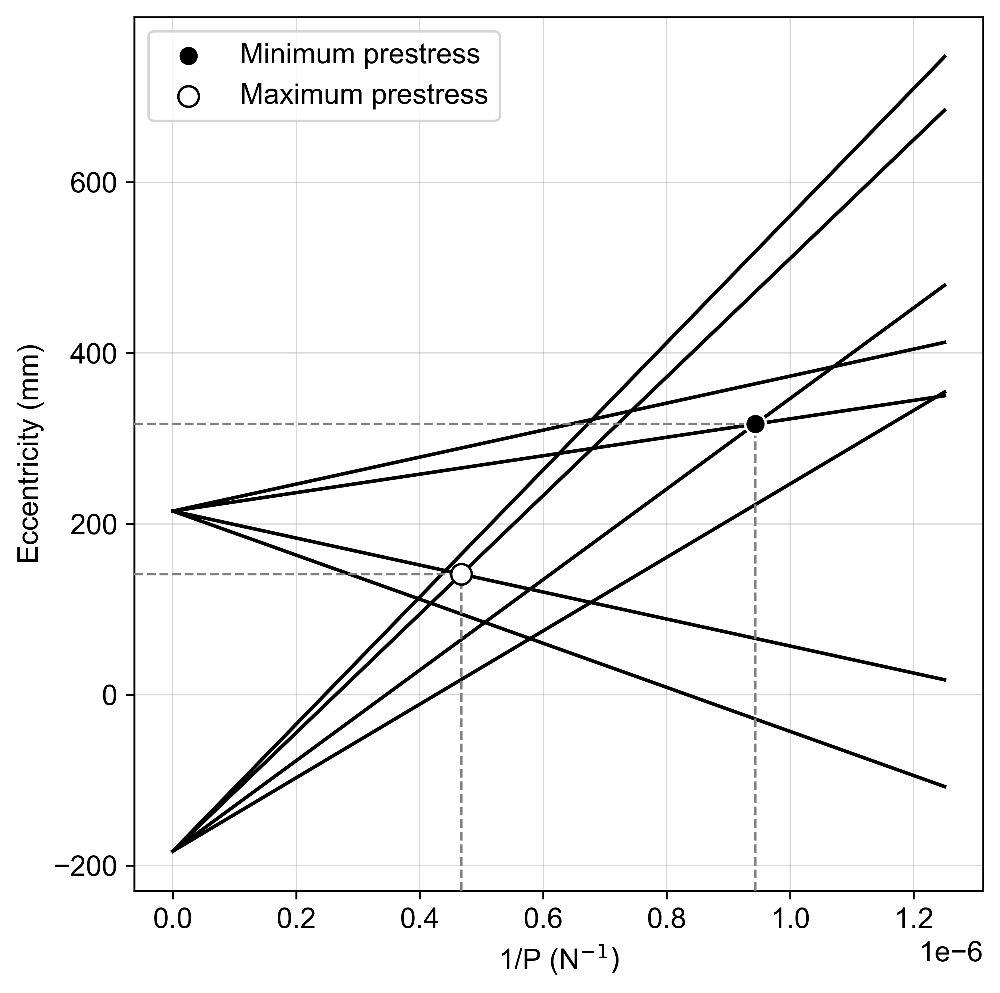

# PyStressed

Prestressed concrete design in python. 

<div align="center">
    
</div>

```python
from pystressed.models import SectionForce
from pystressed.SLS import plot_magnel, optimize_magnel 

# design at servicability limit state 
transfer = SectionForce(A=A, fc=fc, ft=ft, Ztop=Ztop, Zbot=Zbot, Mmax=Mmax, Mmin=Mmin, losses=losses)
service =  SectionForce(A=A, fc=fc, ft=ft, Ztop=Ztop, Zbot=Zbot, Mmax=Mmax, Mmin=Mmin, losses=losses) 

optimize_magnel(transfer=transfer, service=service, ebounds=ebounds, mode='min') 
plot_magnel(transfer=transfer, service=service, line_ext=2.0) 